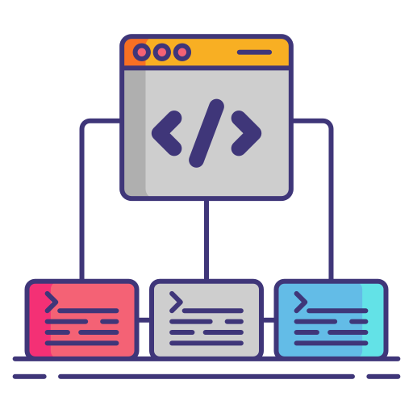

# project-name : Analysis

## Table Of Contents

- [project-name : Analysis](#project-name--analysis)
  - [Table Of Contents](#table-of-contents)
  - [Objectives](#objectives)
  - [FlowChart](#flowchart)
  - [Use Case Diagram](#use-case-diagram)
  - [Leveling Analysis](#leveling-analysis)
    - [Level 001](#level-001)
  - [List of Main Features](#list-of-main-features)
  - [List of Optional Features](#list-of-optional-features)
  - [Evolution](#evolution)

## Objectives

- TODO

## FlowChart

This FlowChart is built with **PlantUML**.

## Use Case Diagram

This Use Case Diagram is built with **PlantUML**.

Type of User :

- TODO

## Leveling Analysis

Leveling Analysis can be used to find features of project and fix any problem in advance. At the end we can use all of this feature as Backlog :

- **Backlog** : List of Feature To do
  - **Release** : Multiple Feature Done
    - **Sprint** : Some Feature Done
      - **Task** : One Feature Done

Starting : each project are long lived, so the best way is to setup first your basic API with a basic Admin interface to start to use the application.

### Level 001

- TODO Level 001 Features

## List of Main Features

- TODO Main Features

## List of Optional Features

- TODO Optional Features

## Evolution

If you want after one BackLog to add some new feature, you can create and add some feature and do leveling analysis, after that, create some new release and develop these new features.
